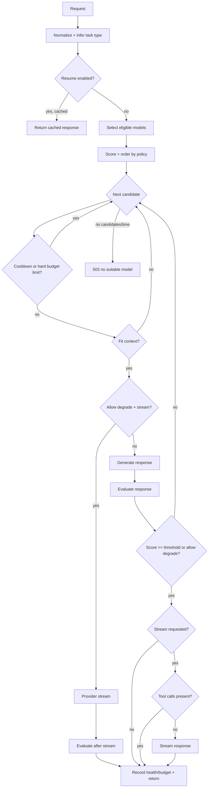

# switchboard

OpenAI-compatible router that selects models by policy, health, budget, and quality gating.

## Quickstart

Install dependencies:

```bash
bun install
```

Run the server:

```bash
bun run index.ts
```

By default it listens on `http://localhost:3000`.

## Endpoints

### `POST /v1/chat/completions`

OpenAI Chat Completions-compatible subset. Supports streaming and non-streaming.

Headers (optional):

- `x-router-task-type`: `code|reasoning|research|rewrite|default`
- `x-router-quality-threshold`: `0..1` or `1..5`
- `x-router-max-wait-ms`: integer
- `x-router-allow-degrade`: `true|false`
- `x-router-request-id`: idempotency key
- `x-router-resume`: `true|false` (return stored result if available; requires admin token unless `ALLOW_INSECURE_RESUME=true`)
- `x-router-debug`: `true` (include routing metadata)

When `x-router-debug: true` is set, non-streaming responses include a `router`
field and an `x-router-metadata` header containing base64 JSON. For streaming,
only the `x-router-metadata` header is added. Metadata is omitted unless the
header is explicitly set.

Tool calling:

- Pass OpenAI-style `tools` and `tool_choice` in the request body.
- Tool calls are returned in `choices[0].message.tool_calls` for non-streaming responses.
- Streaming is disabled when tool calls are present (falls back to non-streaming).
- When `x-router-allow-degrade: true` is set, streaming uses the provider stream and
  evaluation happens after the stream completes.
- Streaming token usage is estimated from input/output text and counts toward provider budgets.

If no acceptable model is available before timeout, returns `503` with:

```json
{
  "error": {
    "code": "no_suitable_model_available",
    "message": "No suitable model available before timeout",
    "retry_after_ms": 10000
  }
}
```

### `POST /v1/responses`

OpenAI Responses-compatible subset (non-streaming only). Accepts an `input` field
as a string or an array of message objects.

Streaming is not supported for this endpoint and will return `400`.
Tool calls are returned in `output[0].tool_calls` when provided by the model.

### `GET /health`

Returns basic status and model counts.

### `GET /metrics`

Prometheus-style metrics.

### `POST /admin/reload`

Reloads config files. Requires `ADMIN_TOKEN` and header `x-router-admin-token`.

## Configuration

Config lives in `config/models.yaml` and `config/policies.yaml`.

`config/models.yaml` defines model capabilities and providers:

```yaml
models:
  - id: codex-cli:gpt-5.2-codex
    provider: codex-cli
    aiProvider: codex-cli
    name: gpt-5.2-codex
    context: 400000
    capabilities:
      code: 5
      reasoning: 5
      research: 5
      rewrite: 5
    costWeight: 1.0
    enabled: true
```

Known `aiProvider` values: `github`, `gemini-cli`, `codex-cli`, `perplexity`.
The GitHub provider is used for Copilot models.

`config/policies.yaml` defines routing, budgets, streaming, and optional code eval:

```yaml
routing:
  default:
    preferred:
      - codex-cli:gpt-5.2-codex
      - gemini-cli:gemini-3-pro-preview
      - gemini-cli:gemini-3-flash-preview
      - github:copilot-gemini-3-pro-preview
      - github:copilot-claude-opus-4.5
      - perplexity:sonar-reasoning-pro
      - github:copilot-gpt-5-mini
    minCapability: 3
    qualityThreshold: 0.72
    maxAttemptsPerCycle: 3
    pollIntervalMs: 2000
    maxWaitMs: 60000
    weights:
      capability: 1
      reliability: 0.5
      cost: 0.5
      latency: 0.2
      degradePenalty: 1.5
      budgetPenalty: 1

streaming:
  chunkSize: 60
  chunkDelayMs: 0

codeEvaluation:
  enabled: false
  command: bun test
  timeoutMs: 120000
  weight: 0.6
  failurePenalty: 0.2
  cwd: .

evaluationJudge:
  enabled: false
  modelId: codex-cli:gpt-5.2-codex
  minScore: 0.55
```

## Routing flow



## State

SQLite is used for health, budget, and request sessions.
Set `STATE_DB_PATH` to control the location (default: `data/state.sqlite`).

If a request exceeds a model's context window, the router trims oldest
non-system messages to fit. If trimming cannot make it fit, that model is skipped.

## Provider credentials

Adapters use the `ai` SDK providers. Set the environment variables expected by
`@ai-sdk/perplexity` and the CLI-based providers (`ai-sdk-provider-github`,
`ai-sdk-provider-gemini-cli`, `ai-sdk-provider-codex-cli`) for upstream access.

## Testing

```bash
bun test
```

## License

MIT
